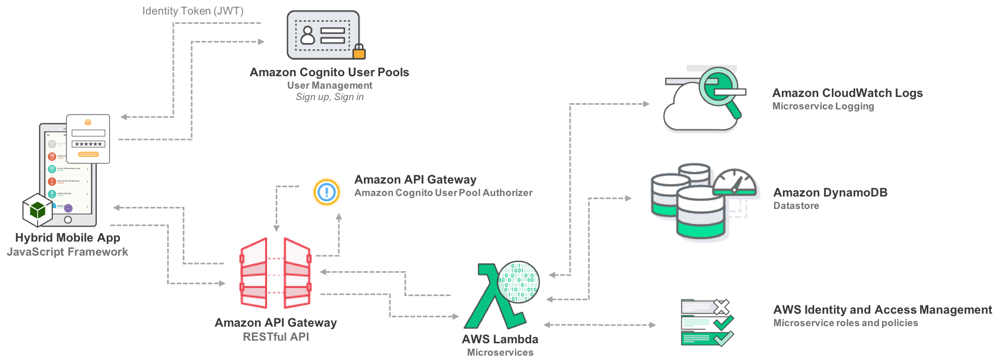

# Mobile Notes 

An example of a serverless app built with React, Node.js and AWS.

## Documentation

This app does the following:

- Handle user registration, authentication with AWS Cognito.
- Use AWS Lambda with API Gateway which is secured by Cognito User Pool authorizer.
- Follow best practices, architectural guidance, and considerations for using managed services on the AWS Cloud to simplify development of RESTful backend services.

This app is a combination of the back-end code from AWS Blog [AWS Mobile App Backend with Hybrid Apps](https://aws.amazon.com/blogs/mobile/aws-mobile-app-backend-with-hybrid-apps/) ([pdf link](https://s3.amazonaws.com/solutions-reference/mobile-backend/latest/mobile-app-backend.pdf)) and the front-end code from the website [serverless-stack.com](https://serverless-stack.com/) with some [differences](#differences).

*Why I use other people's code? To quickly prove a concept, I don't need to reinvent the wheel. The goal of this app is to learn how to successfully build a secure serverless app following AWS best practices.*

> Many thanks to the Solution Architects from Amazon: Sean Senior and Leo Drakopoulos who wrote the super helpful blog and the awesome people who founded Serverless-Stack.com: [Frank Wang](https://github.com/fwang) and [Jay V](https://github.com/jayair).

## App logic

1. An Amazon Cognito User Pool authorizer is associated with a RESTful API hosted in Amazon API Gateway. The authorizer authenticates **every** API call made from a mobile app by leveraging a JSON Web Token (JWT) passed in the API call headers. 
1. Amazon API Gateway is natively integrated with Amazon Cognito User Pools so the validation of the JWT requires no additional effort from the application developer. Amazon API Gateway then invokes an AWS Lambda function that accesses other AWS services, which in this case is Amazon DynamoDB. 
1. When AWS Lambda is invoked, it assumes an AWS Identity and Access Management (IAM) role. The IAM role determines the level of access that AWS Lambda has to Amazon DynamoDB. 

<div></div>

## Installation

1. Clone this repository (with SSH):
    ```
    $ git clone git@github.com:nguyendviet/mobile-notes.git
    $ cd mobile-notes
    ```
1. [Create and deploy Lambda, API Gateway and DynamoDB with execution roles](https://s3.amazonaws.com/solutions-reference/mobile-backend/latest/mobile-app-backend.pdf). The Lambda code is in this repository: `./lambda/`.
1. [Create AWS Cognito User Pools](https://serverless-stack.com/chapters/create-a-cognito-user-pool.html).
1. Follow the steps on Serverless-Stack.com to create your React app or use the code in this repository: `./client/`.
1. Once you've set up Lambda, API Gateway, DynamoDB and Cognito, you can set up your own `aws-variables.js` file which should look like: `./client/src/lib/aws-variables.js-example`.
1. Run these commands (I use `yarn` but you can use `npm`):
    ```
    $ cd client
    $ yarn install
    $ yarn start
    ```
1. You should see the main page of the app that looks like the one on Serverless-Stack.com.

## Debug

- `gyp`, `node-gyp` and `node-pre-gyp` error => [Solution](./docs/err/grpc.md).

## Test

- Since I use the front-end code from Serverless-Stack.com, I don't test it, but you should test your front-end code using frameworks like [nightmare](https://www.npmjs.com/package/nightmare).
- For Node.js functions, I usually use [mocha](https://www.npmjs.com/package/mocha) and [chai](https://www.npmjs.com/package/chai).
- For your convinience, there are some Lambda test events I created along with the default GET from Amazon Blog:
    ```
    // POST:
    {
        "resource": "/notes/{noteid}",
        "httpMethod": "POST",
        "body": "{\"userid\": \"user2\", \"noteid\": \"note2\", \"content\": \"note 2 content\"}"
    }
    // PUT:
    {
        "resource": "/notes/{noteid}",
        "httpMethod": "PUT",
        "body": "{\"userid\": \"user2\", \"noteid\": \"note2\", \"content\": \"note 2 content has been updated!\"}"
    }
    // GET with specific userid and noteid. 
    // I recommend you use your real userid and noteid to test after succesffully created a user from React app.
    {
        "resource": "/notes/{noteid}",
        "httpMethod": "GET",
        "pathParams": "{}",
        "queryStringParameters": {
            "userid": "user2"
        },
        "pathParameters": {
            "noteid": "note2"
        },
        "payload": {}
    }
    ```

## Differences 
The differences between my code and the code from [AWS Blog](https://aws.amazon.com/blogs/mobile/aws-mobile-app-backend-with-hybrid-apps/) and Serverless-Stack.com:

- The front-end code ([Ionic framework](https://ionicframework.com/)) from Amazon Blog is outdated. Since 2016 when the blog was written, Ionic has changed the folder structure amongst other things so I wasn't able to make the code from Amazon work with the current Ionic framework.
- At the time of this documentation (April 2019), Ionic has released a beta version for React. However, it seems more complicated than it should be and I'm more familiar with React than Angular (which is originally supported by Inonic) so I decided to use the front-end code from Serverless-Stack.com. If you want to develop your own mobile app, consider using [React Native](https://facebook.github.io/react-native/).
- Serverless-Stack.com uses [Serverless Framework](https://www.npmjs.com/package/serverless) to develop their Lambda code but I want to stick with AWS so I use AWS Blog's code. You can use [AWS SAM](https://docs.aws.amazon.com/serverless-application-model/latest/developerguide/what-is-sam.html) to develop and troubleshoot your Lambda functions.
- I also changed the folder structure of the React app (`./client/`) and some variable names.
- I use [reacstrap](https://www.npmjs.com/package/reactstrap) (which uses [Bootstrap 4](https://getbootstrap.com/)) instead of [react-bootstrap](https://www.npmjs.com/package/react-bootstrap) (which uses [Bootstrap 3](https://getbootstrap.com/docs/3.3/)).
- Serverless-Stack.com only secure their routes, not their API URLs, that's why I implemented Cognito User Pool authorizer from Amazon and edited the front end code so that every API call must include a token. For example:
    ```
    return API.get("notes", `/notes/${noteid}/`, {
        headers: {
            "Authorization": token
        },
        queryStringParameters: {userid: userid},
        pathParameters: {noteid: noteid}
    });
    ```
- There's a lot more from Serverless-Stack.com like Automating Serverless deployments and Code Splitting in Create React App, you should definitely check it out.
- In the (near) future, I'm going to  use AWS CloudFormation (and perhaps Terraform) to provision the infrastructure instead of the tools that Serverless-Stack.com uses. *Update 28 June 2019*: So, the future is now. See how to provision the whole app with CloudFormation [here](./cloudformation/README.md).

## Author(s)

- <b>Viet Nguyen</b>: [LinkedIn](https://www.linkedin.com/in/nguyendviet)

**[⬆ back to top](#documentation)**
